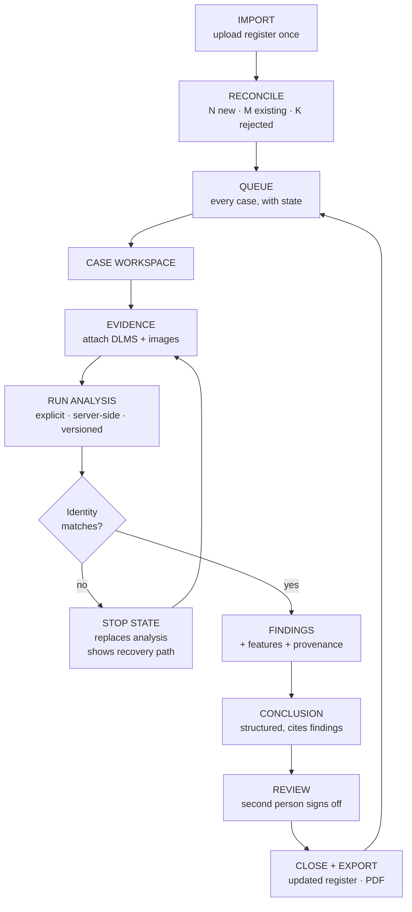

# FFR View — Flow, UX and UI Teardown

**Reviewed:** 19 Aug 2026 · **Head:** `8493e64` · **Scope:** `app/`, `db/`, `rules/`, `config/`
**Codebase:** 15,327 LOC · 5 routes · 24 API endpoints · 10 React components (all client)

---

## 0. Verdict

This is not a badly styled app. It is a **competently styled app with no product underneath it**. The visual layer is fine — navy rail, white surfaces, restrained shadows, sensible blue. Under it there is no case lifecycle, no server-side truth, no explicit analysis step, and no working layout below 900 px.

Three things define the problem:

1. **There is no flow.** There is a sequence of forms. The user is never told where they are, what happens next, or what the app is waiting for. Four of the five screens are one unbounded vertical scroll of near-identical cards.

2. **The best engineering in the repo is invisible.** `dlms-analysis.ts` computes per-check derived features, the exact source cell each value came from, and — critically — whether a threshold came from the meter's own configuration or from a guessed fallback (`profileSources`). All of it is computed, POSTed, written to D1, and **never rendered on any screen**. The engineering went deeper than the interface, so the interface makes the engineering look shallow.

3. **The governance story is unfalsifiable.** The 60-check analysis runs in the browser. The server stores whatever the browser sends — including the bundle version, profile key and adapter key the browser *claims* it used. An "immutable, audited, versioned" rule system whose findings are self-asserted by the client is not a governance system.

Two hard blockers before anything cosmetic:

| | |
|---|---|
| **P0** | The app is unusable below 900 px. At 768 px the sidebar occupies ~80% of the viewport and content is off-screen. At 390 px only the sidebar renders. |
| **P0** | Analysis integrity: client computes, server trusts. Raw workbooks are not retained by default, so no finding can ever be re-derived or disputed. |

---

## Contents

1. [What the product actually is](#1-what-the-product-actually-is)
2. [The flow, and its eight breaks](#2-the-flow-and-its-eight-breaks)
3. [The navigation is inside-out](#3-the-navigation-is-inside-out)
4. [UX defects, by severity](#4-ux-defects-by-severity)
5. [The UI and its missing design system](#5-the-ui-and-its-missing-design-system)
6. [The architecture that causes the UX](#6-the-architecture-that-causes-the-ux)
7. [Rebuild — the target flow](#7-rebuild--the-target-flow)
8. [Rebuild — screen blueprints](#8-rebuild--screen-blueprints)
9. [Rebuild — the design system](#9-rebuild--the-design-system)
10. [Sequence, and what to delete](#10-sequence-and-what-to-delete)

---

## 1. What the product actually is

### 1.1 The job to be done

> A returned electricity meter arrives with a customer complaint. Decide, **with evidence**, why it failed — and be able to defend that decision to a utility, a regulator, or your own quality team eighteen months later.

Everything in the app should serve that one sentence. Three things follow from it immediately, and none of them exist today:

- **The unit of work is a case, and a case has a state.** Open, blocked, analysed, in review, concluded, closed.
- **A conclusion is a record, not a screen.** It has an author, a reviewer, a timestamp, a set of cited findings, and a version of the rules it was produced under.
- **Evidence must survive the browser session.** If you cannot re-derive a finding, you cannot defend it.

### 1.2 What was actually built

Three half-products sharing a shell, none finished:

| Screen | Wants to be | Actually is |
|---|---|---|
| `/` Cases | A work queue | An append-only upload log capped at 50 rows |
| `/cases/[id]` | A case workspace | A 4,113 px single-column form stack |
| `/rules` | A rule authoring IDE | A 5,408 px flat list with a non-sticky JSON textarea |
| `/governance` | A release console | Five paragraphs of static policy prose, with the actual controls 1,400 px below the fold |
| `/settings` | Admin config | A 3,568 px scroll of eight unrelated concerns behind one Save button |

### 1.3 The identity problem

The product cannot decide whether it is an **analyst tool** or a **governance console**, so it is neither. Three of four top-level nav slots are configuration surfaces. The homepage headline is *"Development proof of concept."* The sidebar footer explains a legal caveat. The topbar says *"Private pilot workspace / Staged evidence and governed rules"* — on every single screen, hardcoded seven times across five files.

An analyst opening this app is told, before anything else, what it **cannot** do. Nowhere is she told what she should do next.

---

## 2. The flow, and its eight breaks

### 2.1 The current flow

```mermaid
flowchart LR
  A["/ Cases<br/>list + upload<br/>compete on one route"] --> B["Parse register<br/>in browser"]
  B --> C["Pick ONE row<br/>from table"]
  C --> D["POST /api/cases<br/>always INSERT"]
  D --> E["/cases/:id"]
  E --> F["Pick meter role<br/>old / new"]
  F --> G["Select DLMS file"]
  G --> H["Parse + evaluate<br/>60 checks IN BROWSER"]
  H --> I["POST analysis blob<br/>server stores verbatim"]
  I --> J["Render findings"]
  J --> K(["END — no conclusion,<br/>no export, no review"])
```



Read that again and notice what is missing: there is no step where a human decides anything, and there is no step where the system asks for confirmation before doing work.

### 2.2 The eight breaks

---

#### F-01 · Import is one row at a time, and the parse dies on refresh — **P0**

`app/page.tsx` holds the parsed register in `useState`. The upload panel and the row-picker occupy the same route with no URL state. Refresh, navigate away, or open a case in a new tab, and the whole register is gone — you re-upload and re-parse to reach row 2.

A register is a **batch**. The FFR IG workbook routinely carries dozens of meters. The app makes you re-upload it once per case.

```
app/page.tsx:23   const [register, setRegister] = useState<FfrRegisterInspection | null>(null)
app/page.tsx:248  {!register && ( <UploadStage … /> )}   ← upload panel disappears once parsed
```

---

#### F-02 · "Creates (or reopens)" is false — you get duplicates — **P0**

The UI promises: *"Picking a row creates (or reopens) that case's persisted record."*
`createCase` unconditionally `INSERT`s a fresh UUID. There is no unique constraint on `(case_ref)`, on `(register_row_number)`, or on any workbook hash.

I confirmed this live: the running database contains **two cases both labelled 13644**, same sub-division, same complaint, different timestamps.

```
db/cases.ts  createCase()  →  INSERT INTO cases … VALUES (makeId(), …)   ← no upsert, no dedupe
db/schema.ts cases         →  index("idx_cases_case_ref")                ← index, not uniqueIndex
```

---

#### F-03 · There is no case status, so there is no queue — **P0**

```ts
// db/schema.ts — the entire `cases` table
id · caseRef · registerArtifactName · registerRowNumber · registerRowJson
productFamily · complaintKey · complaintLabel · createdBy* · createdAt · updatedAt
```

No `status`. No `assignee`. No `priority`. No `closedAt`. No `blockedReason`.

Consequences: nobody can answer *"what do I work on today?"*, *"who owns this?"*, *"how many cases are stuck on identity mismatch?"*, or *"is this case done?"* The list is sorted by `createdAt DESC`, hard-capped at 50 (`db/cases.ts:337`), with no pagination, search, filter or sort in the UI. Case 51 is unreachable.

---

#### F-04 · Analysis has no run step — **P1**

Selecting a file *is* the analysis. `handleDlmsUpload` → `uploadDlms` → parse + evaluate 60 rules + POST, synchronously, on the main thread. There is no confirmation, no progress, no cancel, no cost signal, and no way to choose which bundle version to run under.

The review doc (§5.1) specified a visible ten-step pipeline. What shipped is a button label that changes to *"Reading DLMS report…"*.

---

#### F-05 · Identity mismatch does not stop anything — **P1**

The review doc (§5.2) was explicit: on `IDENTITY_NO_MATCH`, the exception view should **replace** downstream content. Today it renders a red callout and then continues to render, below it: the full 60-check findings panel, the artifact card, the image upload stage, and a "Case rule gate" card.

A user who scrolls past the banner — and everyone scrolls past banners — reads 60 findings that are explicitly not attributable to this case.

```
app/cases/[caseId]/page.tsx:390  {latestReport && ( identityValid ? … : callout danger )}
app/cases/[caseId]/page.tsx:404  {latestReport?.analysis && <DlmsFindingsPanel … />}  ← renders regardless
```

---

#### F-06 · "Re-run with current profile" is impossible after a reload — **P1**

```ts
const rerunAnalysis = async () => { if (!lastUploadedFile) return; await uploadDlms(lastUploadedFile); };
```

`lastUploadedFile` is a `File` object in React state. Reload the page and the button vanishes, even though the report is persisted in D1. The Settings page tells administrators: *"Change a profile or mapping here, save a governed version, then re-run the same report to see the effect."* That workflow cannot be completed, because the raw workbook is not retained and the client cannot re-derive without it.

This is the single clearest symptom of the client-side-analysis architecture.

---

#### F-07 · History exists in the schema and nowhere else — **P2**

`dlms_reports` carries `createdAt`, `bundleVersion`, `profileVersion`, `adapterVersion`, and two indexes explicitly built for time-ordered retrieval:

```
index("idx_dlms_reports_case_created").on(caseId, createdAt)
index("idx_dlms_reports_meter_created").on(caseMeterId, createdAt)
```

The API exposes only `getLatestDlmsReports()`. No screen shows a run list, a previous run, or a diff between two runs. The entire point of versioned rule bundles — *"what changed between v1 and v2 for this meter?"* — has no interface.

---

#### F-08 · The flow ends at findings — **P1**

There is no conclusion, no RCA record, no CAPA, no reviewer sign-off, and no export. The last card on the case page is a text block that says the case *"is eligible for provisional interpretation"* — and then offers a link to the rule library.

The user's actual next question — *"so what do I write in the return report?"* — is unanswered by the product.

---

## 3. The navigation is inside-out

### 3.1 Current

| Slot | Label | Audience | Frequency |
|---|---|---|---|
| 1 | Cases | Analyst | Daily |
| 2 | Rule library | Author | Monthly |
| 3 | Governance | Admin | Quarterly |
| 4 | Settings | Admin | Quarterly |

**75% of the primary navigation serves 3 people and is used 4 times a year.** The review doc flagged this (§5.4) and it is unchanged.

### 3.2 Governance and Settings are the same screen, cut in half

The catalogue JSON editor lives in **Settings**; its review and release controls live in **Governance**. Creating an adapter requires: Settings → paste JSON → Create governed draft → navigate to Governance → Submit for review → Approve → Release → navigate back to Settings → Save mapping. Eight steps across two screens with no breadcrumb between them.

### 3.3 Proposed

```
ANALYST (default)
  ├─ Queue            ← the home screen. status, owner, age, blocker
  ├─ Imports          ← register batches, reconciliation history
  └─ Reports          ← exports and run history

ADMIN  (only rendered for author/reviewer/admin roles)
  ├─ Rules            ← library + authoring + fixtures + impact
  ├─ Releases         ← one lifecycle board: draft → review → release → rollback
  ├─ Configuration    ← profiles, mappings, adapters, branding, retention
  └─ Audit            ← the audit event stream, currently buried inside Governance
```

Three primary items instead of four, config demoted behind a role gate, and the two governance surfaces merged into one board.

---

## 4. UX defects, by severity

| ID | Defect | Sev | Evidence |
|---|---|---|---|
| U-01 | Layout broken below 900 px | P0 | `globals.css:93` + `:1004` — see §5.1 |
| U-02 | Error codes shown as the headline | P1 | `MULTIPLE_FFR_REGISTERS: upload one FFR register at a time.` — `page.tsx:68` |
| U-03 | One overwritable `notice` string, non-transient, no queue | P1 | `setNotice()` in every handler |
| U-04 | No loading skeletons; `<p>Loading case…</p>` | P1 | `cases/[caseId]/page.tsx:137` |
| U-05 | Section title used as loading state: `"Loading cases…"` | P2 | `page.tsx:189` |
| U-06 | Rules page: 60 items, no search, no filter, non-sticky editor | P1 | 5,408 px page height |
| U-07 | Every rule badged amber `ENABLED` — amber is the warning tone | P1 | `<Status tone={rule.enabled ? "warning" : "neutral"}>` |
| U-08 | Settings: 8 concerns, one global Save, no dirty state | P1 | 3,568 px page height |
| U-09 | Governance: 5 static prose cards above the fold, controls below | P1 | Actual actions at ~1,400 px |
| U-10 | Meter role picker uses buttons without `radiogroup` semantics | P2 | `.meter-role` buttons |
| U-11 | Findings are nested `<details>` in `<details>`; no severity sort, no deep link, no export | P2 | `dlms-findings.tsx` |
| U-12 | Topbar duplicated 7× across 5 files with identical static copy | P2 | belongs in `layout.tsx` |
| U-13 | Brand is still a generic blue `K` square | P2 | `brand-header.tsx` — review §6.2 unresolved |

### U-02 in detail — errors speak developer

```
MULTIPLE_FFR_REGISTERS: upload one FFR register at a time.
MISSING_REQUIRED_WORKBOOK: choose the FFR register first.
UNRECOGNIZED_FILE: the DLMS workbook could not be validated.
```

The machine code is the headline and the human sentence is the subtitle. Invert it. The code belongs in a `<small>` for support, or in a copyable detail line — never as the first thing a user reads.

Worse, `UNRECOGNIZED_FILE` is the catch-all for *any* thrown error, including network failures and server 500s. A user whose D1 connection dropped is told their spreadsheet is malformed.

### U-07 in detail — semantic colour is inverted

`Status` has five tones: `neutral · good · warning · danger · ai`. On the rules page, all 60 enabled rules render `tone="warning"` in amber. A page whose normal, healthy state is 60 amber badges has trained the user to ignore amber — which is the exact colour the findings panel uses for *"needs review"*.

---

## 5. The UI and its missing design system

### 5.1 Responsive is not degraded — it is broken

I captured the running app at four widths.

| Width | Result |
|---|---|
| 1440 × 900 | Correct |
| 1024 × 768 | Fixed 256 px rail = 25% of viewport. Table's `Open case` column clipped off-screen. Body text truncated mid-sentence. |
| **768 × 1024** | **Sidebar occupies ~80% of the viewport. Main content pushed off-screen right.** |
| **390 × 844** | **Only the navy sidebar renders. Zero content visible.** |

Root cause, two lines:

```css
/* globals.css:93 */
.app-shell { min-height: 100vh; display: flex; }        /* never becomes column */

/* globals.css:1004 — @media (max-width: 900px) */
.sidebar { position: static; width: auto; … }           /* becomes a flex ROW sibling */
.main    { margin-left: 0; }
```

Releasing the sidebar from `position: fixed` without ever setting `flex-direction: column` on `.app-shell` turns it into a row item that competes for width. The `@media (max-width: 1180px)` block only re-flows grid columns; it never reclaims the 256 px rail.

This is not a polish item. Field and lab review on a tablet is a plausible use case, and the app does not render there at all.

### 5.2 The token system covers a third of what it needs to

Tokenised: colour, radius, shadow. **Not tokenised:** typography, spacing, control heights, borders, geometry, breakpoints, content width.

```
12 distinct font sizes:  9, 10, 11, 12, 13, 14, 15, 16, 17, 18, 22, 24 px
16 distinct spacing values: 1,2,4,6,8,10,12,14,16,18,20,24,32,36,40,64 px
                            ↑ 6, 10, 14, 18 are off any 4 px grid
```

Meanwhile `@import "tailwindcss"` sits at the top of `globals.css` and Tailwind is in devDependencies — and **not one utility class is used in any `.tsx` file**. Every `className` is a bespoke semantic class. That is a full build-time dependency and a 1,023-line hand-rolled stylesheet paying for each other's job.

### 5.3 The type is too small for the data it carries

| Size | Count | Used for |
|---|---|---|
| 9 px | 1 | Finding detail labels (`Threshold / rule`, `Source`) |
| 10 px | 13 | Rule IDs, measured values, field labels, nav descriptions |
| 11 px | 21 | Most metadata |
| 12 px | 17 | Table content |
| 13 px | 10 | **Body copy** |

The review doc asked for 14 px body and an 11 px floor. Neither happened. The most damaging case: `.finding-row summary small` is **10 px monospace** and carries `DLMS-FND-005 · Meter serial: AS2373952` — the rule identifier and the measured value, which is the highest-value data on the entire screen.

### 5.4 Every section looks equally important

The `SectionHead` component emits `eyebrow → h2 → description → action` and it is used for all 34 sections in the app. Combined with a uniform card (`1px border + 12px radius + same shadow`), a static policy paragraph on the Governance page has exactly the same visual weight as *"IDENTITY_NO_MATCH — case-level analysis is blocked"*.

There is no visual hierarchy because there is no editorial hierarchy. Nothing was ever ranked.

### 5.5 Evidence layers are undifferentiated

The review doc (§6.6) specified a semantic system: source evidence, deterministic calculation, AI observation, analyst confirmation, inference, contradiction, missing. None of it was implemented. In the current findings panel, a value read directly from cell `Profile!D14` and a value derived from a fallback profile parameter are rendered identically, in the same grey, at the same size.

This is the single highest-leverage UI change available, because the data to drive it **already exists** (`profileSources`, `SourceReference[]`, `contextOnly`) and is being thrown away.

---

## 6. The architecture that causes the UX

### 6.1 Everything is a client component

```
10 of 10 .tsx components carry "use client"
Only layout.tsx is a server component
```

Consequences, all user-visible:

- Every navigation renders an empty shell, then pops in after 3–4 sequential fetches.
- `useSharedGovernance()` re-runs `/api/governance/bootstrap` + `/settings` + `/active-configuration` on **every route change**. There is no cache and no context.
- `BrandHeader` independently fetches `/api/governance/settings` — a fourth duplicate request, purely to find a logo URL, on every page.
- Nothing is server-rendered, so there is no meaningful first paint, no streaming, and no SEO/OG parity with what the metadata claims.

The hook justifies this with a comment describing a project convention:

```ts
// app/lib/use-shared-governance.ts:16-22
// … duplicated independently by each page component per this
// project's no-shared-context convention.
```

There is no such convention. There is no `CLAUDE.md`, no `AGENTS.md`, no contributing guide, and no other reference to it anywhere in the repository. A constraint was invented to justify a shortcut.

### 6.2 The analysis runs in the browser and the server believes it

```
app/lib/workbook-parser.ts  →  import * as XLSX from "xlsx"     ← in the client bundle
app/cases/[caseId]/page.tsx →  inspectDlmsWorkbook(file, …)     ← 60 rules evaluated client-side
                            →  POST { analysis, bundleId, bundleVersion, profileKey, … }
db/cases.ts:398-406         →  if (!Array.isArray(input.analysis.findings)) throw
                            →  if (json.length > 1MB) throw
                            →  INSERT
```

The server's entire validation of a governed analysis is: *is `findings` an array, and is it under a megabyte.* The `bundle_id`, `bundle_version`, `profile_key`, `profile_version`, `adapter_key` and `adapter_version` columns — the provenance chain the whole Governance screen exists to protect — are **supplied by the client** and stored without verification.

Combine that with retention defaulting to zero (raw workbooks discarded), and you get an audit trail that records conclusions nobody can check, attributed to rule versions nobody confirmed, derived from evidence nobody kept.

Everything on `/governance` — immutable versions, four-eyes approval, named-admin release, rollback — is ceremony around a number the browser made up.

### 6.3 Two API surfaces are fully built and never called

| Endpoint | Server | UI |
|---|---|---|
| `/api/governance/runs` | `createRunSummary`, `listRunSummaries`, role-gated | **0 references** |
| `/api/governance/fixtures` | implemented | **0 references** |

`runs` is the analysis history the product needs (F-07). `fixtures` is the rule-testing surface the review doc demanded (§5.4). Both exist. Neither is wired to a screen.

### 6.4 The computed gold is discarded

`DlmsAnalysis` carries three fields that no component reads:

| Field | What it holds | Why it matters |
|---|---|---|
| `features: AnalysisFeature[]` | Every derived measurement with its source cell reference | This is the engineering output an analyst actually needs |
| `profileSources` | Per-parameter: `"workbook"` or `"provisional fallback"` | Tells the user whether a threshold came from *this meter's* config or from a guess |
| `finding.evaluation` | The resolution trace for the rule | The "show your working" that makes a finding defensible |

```
$ grep -rn "\.features\|profileSources\|\.evaluation" app --include=*.tsx
app/cases/[caseId]/page.tsx:197:  features: inspection.features,     ← POSTed, never rendered
```

`profileSources` alone would resolve most of the trust problem this product has. A finding that says *"Low voltage excursion — threshold 207 V, derived from **fallback** nominal 230 V because MeterConfiguration was unreadable"* is a completely different object from one that says *"threshold 207 V, from the meter's own configuration."* Today they look identical.

### 6.5 Open dependency advisories

```
nanoid    < 3.3.18   HIGH      infinite loop on zero-size custom generator
dompurify            MODERATE  XSS via detached subtree after IN_PLACE hook removal
```

Flagged in the review doc (§7.1). Still open. `npm audit fix` resolves both.

---

## 7. Rebuild — the target flow

### 7.1 The flow



### 7.2 The seven rules that make it work

1. **Import once, create many.** The server parses the register, hashes it, and returns a reconciliation preview: *"24 rows · 19 new cases · 4 already imported · 1 rejected (missing Old_Meter_Number)."* One button creates all 19. Idempotent on `(registerHash, rowNumber)`.

2. **The queue is home.** Not the upload form. An analyst opens the app and sees her work, filtered and sorted, with the blocker on each row.

3. **Case identity is persistent chrome.** A sticky header carrying case ref, meter serial, complaint, status, current blocker, and the one primary action — visible on every tab, at every scroll position.

4. **Upload ≠ analyse.** Attaching evidence is one action. Running analysis is a separate, explicit action that creates a **Run** record. The run is a server job with a visible pipeline and a cancel.

5. **A stop state replaces content; it does not sit above it.** `IDENTITY_NO_MATCH` swaps the Analysis tab for a resolution screen showing the detected DLMS serial, the FFR old/new candidates, both file hashes, and exactly two recovery actions. Nothing downstream renders.

6. **Every run is immutable and comparable.** Bundle version, profile version, adapter version, and input hashes are recorded **by the server, from the server's own state** — never from the request body. The History tab lists runs and diffs any two.

7. **A conclusion is a record with a reviewer.** Structured cause, cited finding IDs, author, reviewer, timestamp, rule version. Not a textarea.

### 7.3 The case state machine

```
DRAFT ──import──▶ OPEN ──attach evidence──▶ EVIDENCE_READY ──run──▶ ANALYSED
                   │                              │                     │
                   │                              └──identity fail──▶ BLOCKED ──┐
                   │                                                            │
                   └◀───────────────────────────────────────────────────────────┘
                                                                    │
ANALYSED ──author concludes──▶ IN_REVIEW ──approve──▶ CONCLUDED ──export──▶ CLOSED
                                    │
                                    └──reject──▶ ANALYSED
```

**Schema additions required:**

```ts
cases: {
  status:        text  // draft|open|evidence_ready|analysed|blocked|in_review|concluded|closed
  blockedReason: text
  assigneeEmail: text
  priority:      text  // low|normal|high
  registerHash:  text  // + uniqueIndex(registerHash, registerRowNumber)
  concludedAt:   text
  closedAt:      text
}
```

---

## 8. Rebuild — screen blueprints

### 8.1 Queue — the new home

```
┌───────────────────────────────────────────────────────────────────────────────┐
│ Queue                                    [ Import register ]  [ Export view ] │
│ ─────────────────────────────────────────────────────────────────────────────│
│ ⌕ meter, case ref, sub-division      Status ▾  Owner ▾  Complaint ▾  Age ▾    │
│ ─────────────────────────────────────────────────────────────────────────────│
│  ▌14  BLOCKED      ▌23  NEEDS ANALYSIS      ▌6  IN REVIEW      ▌ 41  CLOSED   │
│ ─────────────────────────────────────────────────────────────────────────────│
│ CASE   METER       COMPLAINT          STATUS        BLOCKER        OWNER  AGE │
│ 13644  AS2373952   Meter burnt        ● BLOCKED     Identity ≠     SS     4d  │
│ 13643  AS2373110   Display defective  ● ANALYSED    —              SS     2d  │
│ 13640  AS2371882   No communication   ○ OPEN        No DLMS file   —      9d  │
│ 13639  AS2371004   Meter dead         ◐ IN REVIEW   Awaiting RK    SS     1d  │
│ ─────────────────────────────────────────────────────────────────────────────│
│ Showing 1–25 of 214                                          ‹ 1 2 3 … 9 ›   │
└───────────────────────────────────────────────────────────────────────────────┘
```

Non-negotiables: server-side pagination, real search on meter serial and case ref, the exception strip above the table, and **a blocker column** — the single most useful column in any operational queue.

### 8.2 Case workspace — persistent identity, tabbed depth

```
┌───────────────────────────────────────────────────────────────────────────────┐
│ ‹ Queue                                                                        │
│ CASE 13644   ● BLOCKED · identity mismatch                     [ Resolve → ]  │
│ AS2373952 → SC10231275 · METER · Meter burnt (METER:B) · Lakhipur_bec · 4d    │  ← sticky
│ ─────────────────────────────────────────────────────────────────────────────│
│ Overview │ Evidence 2 │ Analysis │ Conclusion │ History 3                      │
└───────────────────────────────────────────────────────────────────────────────┘
```

Tab contents:

| Tab | Holds |
|---|---|
| **Overview** | Register context (collapsed by default), complaint, next action, timeline |
| **Evidence** | Files with hash, size, role, uploader, timestamp. Attach here. **Does not analyse.** |
| **Analysis** | Latest run — or the stop state. Findings + features + provenance. |
| **Conclusion** | Structured cause, cited findings, reviewer assignment |
| **History** | Run list. Select two → diff. |

The 460-line case page becomes five focused routes under one layout. Nobody scrolls 4,113 px again.

### 8.3 Analysis tab — the money screen

```
┌──────────────────────────────┬────────────────────────────────────────────────┐
│ RUN 3 · 19 Aug 14:02         │ DLMS-PRF-009  Low profile voltage excursion    │
│ bundle v2 · profile v1       │ ● HIGH · needs review                          │
│ ⌕ filter findings            │ ─────────────────────────────────────────────  │
│ [All 60][Review 24][Gaps 2]  │ MEASURED                                       │
│ ──────────────────────────── │   min V(L1)  198.4 V      Profile!D14–D998    │
│ ▾ Foundation        3 review │   samples    984 of 1000                       │
│   ● HIGH  Voltage reference  │                                                │
│   ● REV   Current reference  │ THRESHOLD                                      │
│   ○ PASS  Meter serial       │   lower band 207.0 V                           │
│ ▾ Profile & quality 7 review │   ⚠ derived from FALLBACK nominal 230 V —      │
│   ● HIGH  Low V excursion  ◀ │     MeterConfiguration had no usable value     │
│   ● REV   Long profile gaps  │                                                │
│ ▾ Events            8 review │ EVALUATION                                     │
│ ▾ Complaint context 6 review │   min(V) 198.4 < 207.0 → attention             │
│                              │ ─────────────────────────────────────────────  │
│                              │ CANNOT PROVE · a low reading does not          │
│                              │ establish a physical fault in the meter        │
│                              │ NEXT · confirm supply-side voltage at site     │
│                              │                                                │
│                              │            [ Cite in conclusion ]  [ Copy ID ] │
└──────────────────────────────┴────────────────────────────────────────────────┘
```

Everything on the right panel **already exists in `DlmsAnalysis`** and is currently thrown away. The amber `⚠ derived from FALLBACK` line is `profileSources`. The measured block is `features`. The evaluation line is `finding.evaluation`.

Evidence-layer colour, applied consistently:

| Layer | Colour | Meaning |
|---|---|---|
| Source evidence | Blue | Read directly from a workbook cell |
| Deterministic calculation | Teal | Derived by the engine from source values |
| Fallback / assumed | **Amber** | Threshold came from a profile default, not the meter |
| Inference | Indigo | Model-suggested, not proven |
| Analyst confirmed | Green | A human signed off |
| Contradiction | Red outline | Two evidence sources disagree |
| Missing | Grey dashed | Evidence gap |

### 8.4 Identity stop state — replaces, not overlays

```
┌───────────────────────────────────────────────────────────────────────────────┐
│                                                                               │
│   ⛔  Analysis stopped — the DLMS report is for a different meter             │
│                                                                               │
│   DETECTED IN WORKBOOK        AS2373110                                       │
│   THIS CASE EXPECTS           AS2373952  (old / defective)                    │
│                               SC10231275 (new / replacement)                  │
│                                                                               │
│   FILE   AS2373110_Reports_2026-06-30.xlsx · 1.2 MB                           │
│          sha256 9b3ac41f…0d4d5df2                                             │
│                                                                               │
│   Product-family mapping cannot resolve a mismatched serial number.           │
│                                                                               │
│   [ Upload the correct DLMS report ]   [ Correct the meter serial on 13644 ]  │
│                                                                               │
└───────────────────────────────────────────────────────────────────────────────┘
```

No findings. No feature table. No image upload. No "Review 60 checks" link. Two recovery paths and nothing else.

### 8.5 Import reconciliation

```
┌───────────────────────────────────────────────────────────────────────────────┐
│ Import register · FFR_IG_Aug2026.xlsx · sha256 4a1c…82ef                      │
│ ─────────────────────────────────────────────────────────────────────────────│
│  24 rows found     19 new     4 already imported     1 rejected               │
│ ─────────────────────────────────────────────────────────────────────────────│
│ ✓ 13650  AS2374001  Meter burnt          → will create                        │
│ ✓ 13651  AS2374002  Display defective    → will create                        │
│ ⊘ 13644  AS2373952  Meter burnt          → exists (imported 6 Aug), skipping   │
│ ✗ 13652  —          Meter dead           → rejected: Old_Meter_Number empty    │
│ ─────────────────────────────────────────────────────────────────────────────│
│                                            [ Cancel ]  [ Create 19 cases ]    │
└───────────────────────────────────────────────────────────────────────────────┘
```

This one screen kills F-01 and F-02 together.

### 8.6 Rules — searchable, sticky, testable

```
┌────────────────────────────┬──────────────────────────────────────────────────┐
│ ⌕ search 60 rules          │ DLMS-PRF-009            [ Test ]  [ Save draft ]  │  ← sticky
│ Group ▾  Severity ▾  ☑ On  │ ──────────────────────────────────────────────── │
│ ──────────────────────────  │ Metadata │ Scope │ Condition │ Fixtures │ Impact │
│ FOUNDATION            12    │ ──────────────────────────────────────────────── │
│   DLMS-FND-001  ✓ on        │ Fixtures                                         │
│   DLMS-FND-002  ✓ on        │   ✓ positive · low-voltage-meter.xlsx  → attention│
│ PROFILE & QUALITY     18    │   ✓ negative · healthy-meter.xlsx      → pass     │
│   DLMS-PRF-009  ✓ on  ◀     │   ✗ boundary · exactly-207v.xlsx       → expected │
│ EVENTS                15    │                             pass, got attention   │
│ COMPLAINT CONTEXT     15    │ ──────────────────────────────────────────────── │
│                             │ Impact · this change flips 12 of 214 stored runs │
└────────────────────────────┴──────────────────────────────────────────────────┘
```

The `/api/governance/fixtures` endpoint already exists to back the Fixtures tab. Rule state renders as a neutral toggle, never an amber badge.

### 8.7 Releases — one board, not two screens

```
┌───────────────────────────────────────────────────────────────────────────────┐
│  DRAFT              IN REVIEW           RELEASED            RETIRED           │
│ ┌─────────────┐    ┌─────────────┐    ┌─────────────┐    ┌─────────────┐     │
│ │ bundle v3   │    │ profile v2  │    │ bundle v2   │    │ bundle v1   │     │
│ │ SS · 2h ago │ →  │ SS · 1d ago │ →  │ ACTIVE      │    │ 12 Jul      │     │
│ │ 3 rules Δ   │    │ needs 2nd   │    │ 214 runs    │    │             │     │
│ │ [ Submit ]  │    │ [ Approve ] │    │ [ Roll back]│    │             │     │
│ └─────────────┘    └─────────────┘    └─────────────┘    └─────────────┘     │
│ ─────────────────────────────────────────────────────────────────────────────│
│ Audit · 19 Aug 14:02 SS released bundle v2 · 18 Aug RK approved profile v2 …  │
└───────────────────────────────────────────────────────────────────────────────┘
```

The lifecycle is a state machine — show it as one. The five static "Control 1–5" prose cards move into a help drawer.

---

## 9. Rebuild — the design system

### 9.1 Type scale — replace 12 ad-hoc sizes with 7 roles

| Token | Size / line | Weight | Role |
|---|---|---|---|
| `--t-display` | 28 / 34 | 600 | Page title |
| `--t-title` | 20 / 27 | 600 | Card and section title |
| `--t-subtitle` | 16 / 24 | 600 | Sub-section |
| `--t-body` | **14** / 21 | 400 | Body copy, form values |
| `--t-data` | 13 / 19 | 400 | Table cells, mono values |
| `--t-meta` | **12** / 17 | 400 | Secondary metadata |
| `--t-label` | **11** / 15 | 600 | Uppercase labels, `+0.06em` |

**Floor is 11 px.** Delete the 9 px and 10 px rules entirely. Rule IDs and measured values move from 10 px mono to `--t-data` 13 px mono.

### 9.2 Spacing — a 4 px scale, nothing off-grid

```css
--s-1: 4px;   --s-2: 8px;   --s-3: 12px;  --s-4: 16px;
--s-5: 20px;  --s-6: 24px;  --s-8: 32px;  --s-10: 40px;  --s-12: 48px;
```

Delete 6, 10, 14, 18, 36 px. Every `padding`, `margin` and `gap` references a token. No new values without a written reason.

### 9.3 Geometry and controls

```css
--h-control: 36px;    --h-control-lg: 44px;   /* ≥44px on touch */
--h-topbar: 56px;     --w-rail: 248px;        --w-rail-collapsed: 64px;
--w-content-max: 1200px;
--r-sm: 4px;  --r-md: 8px;  --r-lg: 12px;
--bp-rail: 1024px;  --bp-drawer: 768px;
```

### 9.4 Colour — separate accent from semantic from evidence

Keep the Kimbal blue as the **accent** (primary actions, active nav) and stop using it for anything else. Semantic status is a separate axis. Evidence layer is a third axis (§8.3). Three axes, never mixed:

| Axis | Values | Used on |
|---|---|---|
| Accent | Kimbal blue | Primary button, active nav, focus ring |
| Semantic | good / warning / danger / neutral | Case status, finding status |
| Evidence | source / calculated / fallback / inference / confirmed / contradiction / missing | Finding detail only |

The current `Status tone="ai"` (indigo) is unused and should be deleted or repurposed as the evidence-layer *inference* colour.

### 9.5 Responsive — an actual specification

| Breakpoint | Shell | Tables | Case workspace |
|---|---|---|---|
| ≥ 1280 | Rail 248 px + content | Full columns | Two-column split |
| 1024–1279 | Rail collapses to 64 px icons | Drop `Created`, `Sub-division` | Single column, right panel becomes a drawer |
| 768–1023 | Rail becomes an off-canvas drawer behind a hamburger | Card list, not a table | Tabs become a select |
| < 768 | Drawer + bottom-sheet actions | Card list | Single column |

Mandatory fix first: `.app-shell` must set `flex-direction: column` — or the sidebar must stay `position: fixed` and translate off-canvas — below `--bp-drawer`. Today it does neither.

### 9.6 Component contract

- **Skeletons, not text.** Every async region renders a shaped skeleton matching its final layout. Delete `<p>Loading case…</p>`.
- **Toasts, not a `notice` string.** A queue with auto-dismiss, `aria-live="polite"`, and manual dismiss. Errors get a persistent inline region, not a toast.
- **Errors read human-first.** Message in `--t-body`, code in `--t-meta` mono below it, with a copy button.
- **One primary action per screen.** Everything else is secondary or in overflow.
- **Tables are `<table>`.** Real `<th scope>`, sortable headers, sticky header row, tabular-nums on every numeric column.
- **Radio groups are radio groups.** The meter-role picker gets `role="radiogroup"` and arrow-key navigation.

---

## 10. Sequence, and what to delete

### Phase 0 — Stop the bleeding (2–3 days)

| | |
|---|---|
| 1 | Fix the sub-900 px layout. Two CSS lines plus a drawer. |
| 2 | `npm audit fix` — clears both advisories. |
| 3 | Add `uniqueIndex(registerHash, registerRowNumber)` and make `createCase` an upsert. Kills the duplicate-case bug. |
| 4 | Move the topbar into `layout.tsx`. Delete 7 duplicates. |
| 5 | Invert error messages — human sentence first, code second. |

### Phase 1 — Move analysis to the server (1–2 weeks)

The one change that makes the governance story true.

- `POST /api/cases/:id/runs` accepts **the file**, not a computed result.
- The server parses with `xlsx`, resolves the active bundle/profile/adapter **from its own state**, evaluates, and writes the run.
- `bundle_version` etc. become server-derived. The client can no longer assert provenance.
- Store the workbook in R2 keyed by hash, with the existing retention policy governing lifetime.
- Wire `/api/governance/runs` — it is already built.
- `Re-run with current profile` now works from a persisted case, forever.

### Phase 2 — Case lifecycle and the queue (1–2 weeks)

- Schema: `status`, `blockedReason`, `assigneeEmail`, `priority`, `registerHash`, `concludedAt`, `closedAt`.
- Server pagination, search, filters on `/api/cases`.
- Build the Queue screen (§8.1). It becomes `/`.
- Build Import reconciliation (§8.5).
- Split the case page into five tabbed routes (§8.2).

### Phase 3 — Make the findings worth reading (1 week)

- Render `features`, `profileSources` and `evaluation` (§8.3). Highest value-per-hour work in the whole plan — the data is already there.
- Implement the evidence-layer colour system.
- Identity stop state replaces content (§8.4).
- History tab with run diff.

### Phase 4 — Design system and admin (1–2 weeks)

- Tokenise typography, spacing, geometry (§9.1–9.3).
- **Decide on Tailwind:** either adopt it and delete most of `globals.css`, or remove the dependency. Not both.
- Merge Governance + Settings into Releases + Configuration (§3.3, §8.7).
- Rules page: search, sticky editor, fixtures tab wired to the existing endpoint (§8.6).
- Replace the placeholder `K` brand mark with the approved Kimbal logo.

### Delete outright

| Delete | Why |
|---|---|
| The five "Control 1–5" prose cards on `/governance` | Static policy text occupying the top of an operational screen. Move to a help drawer. |
| `.sidebar-note` legal caveat | Belongs in the case stop state, not permanent chrome. |
| The topbar strapline *"Private pilot workspace"* | Says nothing, repeated 7×. |
| `@import "tailwindcss"` **or** `globals.css` | One of them is dead weight. |
| `Status tone="ai"` | Unused indigo tone. |
| `screenshots/`, `take-screenshots.mjs`, `take-after-screenshots.mjs`, `.ui-review-dev.*.log` | Untracked working files. `.ui-review-dev.*.log` is not even gitignored — only `.sites-dev.*.log` is. |
| The invented "no-shared-context convention" comment | Then add a real context or a query cache. |

---

## Closing

The intern's instinct on visual direction was right — the navy/white/blue operational shell is the correct register for this product, and it matches the design system doc that already exists in `docs/`. What is missing is not taste. It is **product thinking**: nobody decided what a case is, what state it can be in, who acts on it next, or what "done" means.

Everything in §7 through §10 follows from answering that one question. Fix the flow and the UI mostly designs itself; polish the UI without fixing the flow and you get a prettier version of the same confusion.

The most encouraging finding in this review: `dlms-analysis.ts` is genuinely good work. 1,631 lines of source-linked, provenance-aware, configuration-driven rule evaluation with honest limitation statements on every check. It deserves an interface that shows it.
