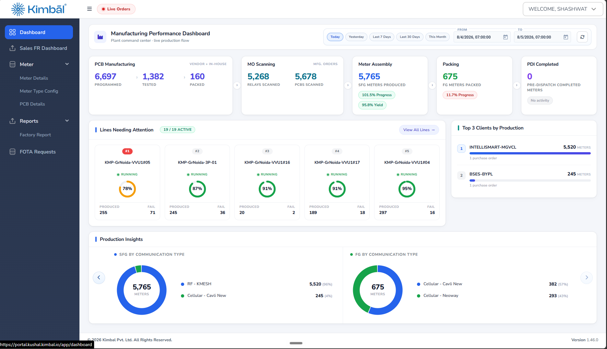

# Kimbal FFR Intelligence

## UI/UX Design System and Product Experience Guide

| Document field | Value |
| --- | --- |
| Purpose | Ensure the FFR application looks and behaves like Kimbal's existing operational applications |
| Primary readers | Product designer, intern, front-end engineer, QA engineer and product owner |
| Status | Required design standard for all MVP screens |
| Last updated | 4 August 2026 |
| Product specification | `docs/FFR_PRODUCT_ARCHITECTURE_SPEC.md` |
| Current pilot plan | `docs/FFR_PILOT_PHASED_IMPLEMENTATION_PLAN.md` |



---

## 1. Design objective

The FFR application must feel like another module in Kimbal's existing operational software family. It should not look like a marketing page, a futuristic AI demonstration or an unrelated design system.

The reference dashboard establishes the visual language:

- dark navy left navigation;
- white global header;
- pale neutral application canvas;
- compact white operational cards;
- thin neutral borders and very restrained shadows;
- Kimbal blue for active navigation and primary action;
- semantic green, amber and red used only for state;
- dense but orderly tables and metrics;
- small, consistent corner radii;
- minimal decoration;
- clear grouping through alignment and spacing rather than slogans or oversized graphics.

The FFR product is information-heavy. Its UX must reduce ambiguity by keeping source data, machine findings, analyst feedback, hypotheses, approved conclusions and CAPA actions visually distinct.

---

## 2. Experience principles

### 2.1 Operational before promotional

Every screen should help a user answer one of these questions:

- What needs my attention?
- What data has arrived?
- What is missing or contradictory?
- What did the rules or AI find?
- What decision is required from me?
- What evidence supports the RCA?
- Who owns the next CAPA action?

Do not add a large hero, catchphrase, decorative orbit, abstract AI artwork or oversized metric unless it materially answers one of these questions.

### 2.2 One page, one primary task

Each page has one dominant purpose and one primary call to action. Examples:

- Case queue: find or open the next case.
- DLMS import: upload/validate a package.
- Diagnostic workspace: review evidence and hypotheses.
- Quality review: approve or request changes.
- CAPA page: update or evaluate actions.

Secondary actions must be visually quieter and grouped near their relevant content.

### 2.3 Show the logical flow

Users must always understand:

1. where the data came from;
2. how it was processed;
3. what is direct evidence;
4. what is AI-generated;
5. what a person accepted or corrected;
6. what is approved;
7. what happens next.

Do not combine these layers into one prose card.

### 2.4 Dense, not muddy

Density is achieved with compact components, not tiny text. Use alignment, repeated column structures, predictable labels and progressive disclosure. A user should be able to scan important states without reading every paragraph.

### 2.5 AI is a capability, not the brand

AI elements use a restrained indigo accent and an `AI-generated` label. They remain inside the same Kimbal shell and card system. Do not use glowing gradients, floating orbs, chat bubbles for structured workflows or anthropomorphic agent illustrations.

### 2.6 State must never depend on color alone

Every state uses at least two signals:

- color plus label;
- color plus icon;
- color plus shape/pattern;
- label plus explanatory text.

### 2.7 Preserve context

Opening evidence, a rule match or audit event should use a side panel, expandable row or linked detail view when possible. Do not make users repeatedly lose their case context.

---

## 3. Design tokens

All production styling must use tokens. Do not introduce ad-hoc hex colors, font sizes, spacing values, shadows or radii inside page components.

### 3.1 CSS token foundation

```css
:root {
  /* Brand and navigation */
  --color-brand-50: #f2f8ff;
  --color-brand-100: #e2f0ff;
  --color-brand-200: #bddcff;
  --color-brand-500: #087ef8;
  --color-brand-600: #096ee0;
  --color-brand-700: #0759b8;
  --color-nav-bg: #2b3d59;
  --color-nav-bg-hover: #344a6b;
  --color-nav-text: #c5d2e4;
  --color-nav-text-muted: #91a6c2;
  --color-nav-active: #2e65e9;

  /* Neutrals */
  --color-canvas: #f4f6fa;
  --color-surface: #ffffff;
  --color-surface-subtle: #f8fafc;
  --color-surface-selected: #f2f7ff;
  --color-border: #dfe4eb;
  --color-border-strong: #cdd5df;
  --color-text: #0d1b32;
  --color-text-secondary: #42526a;
  --color-text-muted: #748197;
  --color-text-disabled: #a4adba;

  /* Semantic states */
  --color-success: #13a454;
  --color-success-bg: #ecfbf2;
  --color-warning: #e89808;
  --color-warning-bg: #fff7e5;
  --color-danger: #ef4348;
  --color-danger-bg: #fff0f1;
  --color-info: #087ef8;
  --color-info-bg: #eef6ff;
  --color-ai: #5b50df;
  --color-ai-bg: #f1efff;
  --color-teal: #0c9b91;
  --color-teal-bg: #eaf8f6;

  /* Type */
  --font-sans: "Geist", "Inter", "Segoe UI", Arial, sans-serif;
  --font-mono: "Geist Mono", "SFMono-Regular", Consolas, monospace;
  --text-10: 0.625rem;
  --text-11: 0.6875rem;
  --text-12: 0.75rem;
  --text-14: 0.875rem;
  --text-16: 1rem;
  --text-18: 1.125rem;
  --text-20: 1.25rem;
  --text-24: 1.5rem;
  --text-32: 2rem;

  /* Spacing: 4px base grid */
  --space-1: 0.25rem;
  --space-2: 0.5rem;
  --space-3: 0.75rem;
  --space-4: 1rem;
  --space-5: 1.25rem;
  --space-6: 1.5rem;
  --space-8: 2rem;
  --space-10: 2.5rem;
  --space-12: 3rem;

  /* Shape and elevation */
  --radius-4: 0.25rem;
  --radius-6: 0.375rem;
  --radius-8: 0.5rem;
  --radius-12: 0.75rem;
  --radius-pill: 999px;
  --shadow-card: 0 1px 2px rgba(24, 39, 75, 0.04), 0 4px 12px rgba(24, 39, 75, 0.04);
  --shadow-popover: 0 14px 36px rgba(24, 39, 75, 0.16);

  /* Application geometry */
  --sidebar-width: 244px;
  --topbar-height: 56px;
  --content-max-width: 1680px;
  --control-height-sm: 32px;
  --control-height-md: 40px;
  --control-height-lg: 44px;
}
```

### 3.2 Token rules

- Use semantic token names in components, not raw palette values.
- Do not make a new shade because a component feels slightly different.
- A new token requires design-system review and a documented use case.
- Use the same token in light and responsive layouts; responsiveness changes layout, not brand color.
- Chart colors must also come from semantic/chart tokens.

---

## 4. Typography

The existing implementation already uses Geist. Keep it as the application typeface; it is visually compatible with the supplied Kimbal dashboard and avoids mixing font families.

### 4.1 Type roles

| Role | Size/line height | Weight | Usage |
| --- | --- | --- | --- |
| Page title | 24/32 px | 600 | Dashboard, Cases, CAPA and Admin page titles |
| Case identifier | 20/28 px | 600 | Primary case/lot number in detail header |
| Section title | 16/24 px | 600 | Card and major subsection heading |
| Card title | 14/20 px | 600 | Metric group, evidence group, table card |
| Body | 14/20 px | 400 | Explanations, important descriptions |
| Compact body | 12/18 px | 400 | Tables, metadata, helper text |
| Label | 11/16 px | 600 | Field labels, status captions, table headers |
| Micro label | 10/14 px | 600 | Rare auxiliary metadata only |
| Metric XL | 32/40 px | 650 | One major dashboard metric when justified |
| Metric | 24/32 px | 650 | Standard card metric |
| Numeric mono | 12/18 px | 500 | IDs, timestamps, values requiring alignment |

### 4.2 Typography rules

- Default readable text is 14 px.
- Tables and dense metadata may use 12 px.
- Never use text below 10 px.
- Avoid all-caps sentences. All-caps is reserved for short labels and table headings.
- Use sentence case for navigation, buttons, tabs and headings.
- Use tabular/monospace numerals for timestamps, IDs and aligned measurement columns.
- Do not use very light weights for operational content.
- Do not use more than three type sizes within one card.

---

## 5. Spacing, sizing and alignment

### 5.1 Spacing system

Use a 4 px base grid. Common component spacing:

- 4 px: icon-to-label micro gap;
- 8 px: compact control/item gap;
- 12 px: row internal gap;
- 16 px: standard card padding on compact cards;
- 20–24 px: standard section/card padding;
- 24 px: grid gap between major panels;
- 32 px: desktop page margin and major vertical separation.

Avoid arbitrary values such as 13 px, 17 px or 27 px unless required for pixel alignment of a specific icon or border.

### 5.2 Alignment

- Page and card content align to a shared left grid.
- Numeric columns align right.
- Text columns align left.
- Status/action columns remain narrow and consistent.
- Card headers align title left and relevant actions right.
- Repeated field groups use the same label/value baseline.
- Do not centre-align paragraphs or operational forms.

### 5.3 Density modes

The MVP has one standard density. Do not implement user-switchable compact/comfortable modes initially.

- Standard table row: 48 px minimum.
- Dense timeline/audit row: 40 px minimum.
- Standard form control: 40 px.
- Icon-only control: 36–40 px with at least 44 px touch target through padding on tablet.

---

## 6. Responsive layout

The product is desktop-first and tablet-responsive. Mobile is supported for read-only/status and simple approval tasks, not for large evidence comparison or RCA authoring.

### 6.1 Breakpoints

| Name | Width | Behavior |
| --- | --- | --- |
| Wide desktop | 1440 px and above | Full 244 px sidebar; up to four content columns; persistent detail side panels where useful |
| Desktop | 1200–1439 px | Full sidebar; three/two-column cards; tables may scroll |
| Tablet landscape | 1024–1199 px | Collapsible sidebar; two-column panels; filters may wrap |
| Tablet portrait | 768–1023 px | Drawer navigation; one/two columns; evidence comparison stacks |
| Mobile | below 768 px | Single column; secondary actions in overflow; complex tables become controlled horizontal scroll or summary cards |

### 6.2 Content width

- Main content uses the remaining width after the sidebar.
- Apply 24–32 px horizontal padding on desktop.
- Cap very wide page content at 1680 px and centre it.
- Do not put narrow report-width content in the middle of an otherwise empty desktop screen; use meaningful companion panels or a controlled max width.

### 6.3 Responsive priority

When width reduces:

1. Preserve case identity, state and primary action.
2. Preserve blocking exceptions and assigned task.
3. Collapse secondary metadata into a details region.
4. Stack charts/cards.
5. Move secondary actions to an overflow menu.
6. Never hide evidence provenance, approval state or contradictions entirely.

---

## 7. Application shell

### 7.1 Global header

Match the Kimbal reference:

- 56 px white bar;
- Kimbal logo aligned left, using the approved asset and proportions;
- optional menu trigger adjacent to the logo/sidebar boundary;
- environment or live-status pill when operationally useful;
- right-aligned notifications and user menu;
- subtle bottom border;
- no large search field unless global search is implemented and useful.

If global search exists, it searches case ID, meter number, return ID, PCB batch and project. Its placeholder must describe those searchable values.

### 7.2 Sidebar

- 244 px dark navy background on desktop.
- Kimbal logo may remain in the white global header; do not duplicate it inside every panel.
- Navigation icons are 18–20 px, one consistent stroke family.
- Default item text uses light blue-grey.
- Active item uses Kimbal blue fill with white icon/text.
- Hover uses a slightly lighter navy surface.
- Section parents can expand/collapse when they contain at least two child pages.
- Badges are used only for actionable counts such as pending reviews or overdue CAPA.
- Place version/build and environment at the bottom.

Recommended navigation:

- Dashboard
- Return lots
- FFR cases
- Batch RCA
- CAPA
- Reports
- Administration, permission-controlled

### 7.3 Page header

Use a compact white panel similar to the reference dashboard:

- page icon in a soft brand square;
- title and one-line purpose;
- date/filter controls on the right when relevant;
- primary action at the far right;
- 16–20 px internal padding;
- 12 px radius and thin border.

Do not repeat the product slogan on operational pages.

---

## 8. Surfaces and cards

### 8.1 Standard card

- White surface.
- 1 px neutral border.
- 12 px corner radius.
- Subtle card shadow token.
- 20–24 px padding for major cards; 16 px for metric/compact cards.
- Header separated with spacing or a subtle divider, not a large colored band.

### 8.2 Card hierarchy

Use only these card roles:

- Metric card: label, value, optional delta/status.
- Section card: title, explanation, content and optional actions.
- Exception card: one blocking/warning state and its resolution action.
- Evidence card: source preview, provenance and review state.
- Task card: owner, due date, state and required action.
- Summary card: concise grouped facts; not a substitute for a table.

Do not nest more than one card level. Avoid a bordered card inside another bordered card unless it is a deliberate evidence item or task.

### 8.3 Corner radius

- 4 px: small labels and chips.
- 6 px: buttons and fields.
- 8 px: compact cards/table containers.
- 12 px: primary page cards and dialogs.
- Pill radius: statuses only.

Do not use decorative alternating or asymmetric corner shapes in the operational application.

---

## 9. Buttons and actions

### 9.1 Button hierarchy

| Type | Appearance | Examples |
| --- | --- | --- |
| Primary | Kimbal blue fill, white text | Upload package, submit RCA, approve, create CAPA |
| Secondary | White fill, neutral border | Export, request changes, compare versions |
| Tertiary/text | No fill, brand text | View evidence, clear filters |
| Danger | Red fill or red-bordered confirmation | Revoke, reject with destructive consequence |
| Icon-only | White/transparent with border where needed | Refresh, notifications, overflow |

### 9.2 Action rules

- Use one primary action per page/major dialog.
- Use verb-first labels: `Upload DLMS package`, `Submit for Quality review`, `Approve RCA`.
- Avoid vague labels such as `Proceed`, `Continue` or `Do it` when the result is not obvious.
- Destructive or irreversible actions require confirmation stating the exact effect.
- Disabled controls include an adjacent reason or tooltip when the user might reasonably expect access.
- Loading buttons retain width and use `Uploading…`, `Analyzing…` or `Generating…`.

---

## 10. Forms, filters and imports

### 10.1 Forms

- Labels remain visible above fields; do not rely on placeholders.
- Required fields use text or an asterisk with an explanation.
- Group related fields under short section titles.
- Use inline validation after interaction and a summary for failed bulk import.
- Preserve user input after validation failure.
- Provide units adjacent to numeric fields.
- Read-only source values look read-only; do not style them like editable inputs.
- Manual override fields require reason code and comment.

### 10.2 Filters

- Place common filters in a single row under the page header.
- Show advanced filters in a popover/drawer.
- Display active filter chips with clear removal.
- Include `Clear all` only when at least one filter is active.
- Keep search and filter state when returning from a case.
- Date ranges show timezone.

### 10.3 File import

Import UI states:

1. Empty/select file.
2. Uploading.
3. Validating.
4. Valid with summary.
5. Valid with warnings.
6. Invalid with row/sheet/field details.
7. Processing.
8. Complete with generated signals.

Show file name, type, size, hash suffix, adapter version and received time. Do not show a generic success toast without a persistent import record.

---

## 11. Tables and lists

Tables are the primary representation for case queues, imports, rules, actions and audit events.

### 11.1 Table standards

- Sticky header for long tables.
- 48 px default row height.
- 12 px table text and 11 px headers.
- Left-align text, right-align numbers and centre only compact status/actions.
- Use zebra striping only if scanning is otherwise difficult; prefer subtle row separators.
- Hover highlights the row without changing layout.
- Entire row may open detail when no conflicting inline action exists.
- Use an explicit overflow menu for row actions.
- Provide sort indicators only for sortable columns.
- Show result count and pagination or virtualization behavior.
- Preserve columns that identify the object: case ID, meter ID or action ID.

### 11.2 Empty table state

State the reason:

- no records exist;
- no results match filters;
- data source not connected;
- user lacks access;
- source failed.

Offer the relevant recovery action, not a decorative illustration.

### 11.3 Case queue columns

Recommended default:

- FFR case;
- meter number;
- complaint;
- Utility/AMISP/project;
- model/PCB batch;
- current state;
- exception;
- owner;
- SLA age;
- last activity.

---

## 12. Status, badges and semantic color

### 12.1 Status badge anatomy

- Optional 6 px dot/icon.
- Short label, ideally one to three words.
- Pill shape.
- Semantic foreground and pale background.
- Never use a saturated full-width bar for routine status.

### 12.2 Semantic mapping

| Color | Meaning | Examples |
| --- | --- | --- |
| Blue | active/selected/in progress | Analysis running, active tab, primary action |
| Teal/green | complete/healthy/accepted | Valid import, accepted finding, approved milestone |
| Amber | needs attention/partial/waiting | Missing optional evidence, due soon, probable cause |
| Red | blocked/failed/unsafe/overdue | Identity conflict, invalid import, rejected approval |
| Indigo | AI-generated/reasoning | AI finding, hypothesis run, model metadata |
| Grey | neutral/inactive/not started | Not configured, queued, not applicable |

Do not use green simply because a number increased. Trend meaning depends on the metric; increased failures are red even if mathematically positive.

---

## 13. Metrics and charts

### 13.1 Metric cards

Match the reference dashboard:

- compact horizontal row;
- label at top;
- prominent value;
- unit visibly associated;
- optional delta or status below;
- no unnecessary icon if the label is clear;
- consistent card height within a row.

Metrics should answer an operational question. Recommended dashboard metrics:

- new returns;
- cases ready for analysis;
- RCA pending Quality review;
- identity/data exceptions;
- median technical turnaround;
- overdue CAPA actions;
- integration failures.

### 13.2 Chart rules

- Use charts only for comparison, trend, distribution or concentration.
- Bar chart: compare categories/batches.
- Line chart: change over time.
- Stacked bar: composition over time.
- Donut: only for a small part-to-whole breakdown with no more than five segments.
- Heat map: model/batch/failure concentration.
- Avoid 3D, gauges, decorative waves and excessive donuts.
- Always show units, timeframe and sample size.
- Provide a data table or accessible summary.
- Use no more than six chart colors at once.

### 13.3 Chart palette

Primary series uses Kimbal blue. Secondary comparison uses teal. Indigo is reserved for AI/model comparison. Amber and red indicate warning/failure, not arbitrary series differentiation.

---

## 14. Evidence and provenance UX

### 14.1 Evidence card

Every evidence item shows:

- source icon/type;
- source name;
- received/retrieved time;
- source record/file;
- adapter/schema version;
- validation status;
- whether it is the active version;
- who/what imported it;
- actions: view, compare version, download if permitted.

### 14.2 Evidence types

Use a small consistent marker:

- Source evidence: blue.
- Deterministic calculation: teal.
- AI-generated observation: indigo.
- Analyst-confirmed finding: green.
- Inference: amber.
- Contradiction: red outline/marker.
- Missing/unavailable: grey dashed marker.

### 14.3 Evidence drawer

Selecting an evidence link opens a right-side drawer containing:

- source preview;
- exact value/record/image region;
- provenance;
- calculations or model output that used it;
- analyst disposition;
- audit history.

The drawer must preserve the user's location in RCA or diagnostic review.

---

## 15. Image-analysis UX

### 15.1 Gallery layout

- Group by external and internal stages.
- Show required view checklist and completion count.
- Use consistent thumbnail aspect ratio.
- Overlay view label and AI-review state.
- Do not place long diagnostic text directly on the image.
- Clicking opens a high-resolution viewer with zoom, pan and annotation toggles.

### 15.2 Finding review

The image viewer uses three columns on wide desktop:

1. Thumbnail/view navigator.
2. Main image with optional bounding boxes.
3. Finding-review panel.

Finding panel shows:

- observation code and plain-language text;
- AI score;
- location;
- image-quality warning;
- accept, reject and correct actions;
- reason/comment;
- linked hypotheses after analyst action.

Use `AI-generated` until accepted. After acceptance, show `Analyst confirmed` while retaining the model attribution in metadata.

---

## 16. Diagnostic-reasoning UX

This is the most important technical screen and must not be represented as one large prose box.

### 16.1 Wide-screen layout

- Left, 60–65%: ranked hypothesis list and evidence matrix.
- Right, 35–40%: selected hypothesis detail, missing evidence and allowed next action.
- Top summary: complaint, active evidence versions, rule bundle and AI model/run.

### 16.2 Hypothesis card anatomy

- rank and hypothesis name;
- AI hypothesis score;
- evidence coverage;
- status: leading, active, weakened or rejected;
- supporting/contradictory/missing counts;
- compact score bar;
- expandable evidence details;
- model/run version.

Do not use a circular gauge for each hypothesis. Horizontal comparison is easier to scan.

### 16.3 Evidence matrix

Use columns:

- evidence item;
- source/type;
- supports;
- contradicts;
- missing/required;
- analyst status.

Cells use icon plus text/accessible label. The matrix allows comparison without repeating paragraphs.

### 16.4 Score explanation

Always place this explanation near the ranking:

> AI hypothesis scores compare the current candidate explanations. They are not calibrated probabilities and do not replace analyst or Quality approval.

### 16.5 Diagnostic stop state

Display the current deepest defensible outcome in a standard summary card:

- confirmed;
- highly probable;
- probable;
- no fault reproduced;
- inconclusive;
- manual validation required.

Show why that state applies and what evidence is missing. Do not use dramatic full-screen warning treatments for normal uncertainty.

---

## 17. RCA review UX

### 17.1 Structured causal chain

Represent RCA as a vertical ordered chain, not a dense paragraph and not disconnected decorative cards:

1. Reported observation
2. Supported symptom
3. Failed function
4. Subsystem
5. Failure point/component
6. Mechanism
7. Initiating cause
8. Contributors
9. Origin
10. Escape point

Each row shows:

- structured code/value;
- concise explanation;
- evidence count;
- confidence/type marker;
- link to evidence drawer.

Unknown deeper levels remain visible as `Not established from available evidence` so causal gaps are clear.

### 17.2 Reviewer layout

- Left/main: submitted RCA fields and evidence links.
- Right/sticky: version, author, completeness, contradictions, comments and review actions.
- `Approve RCA` is primary only when all blocking checks pass.
- `Request changes` is secondary and opens reason/comment fields.
- `Reject as unsupported` uses danger styling and confirmation.

### 17.3 Version comparison

Use a field-by-field diff:

- added: green marker;
- removed: red marker;
- changed: amber marker;
- unchanged fields collapsed by default.

Do not compare two full report pages side by side at tablet widths.

---

## 18. CAPA UX

### 18.1 Default view

Use a list/table for serious work management. Kanban may be an optional view, not the only representation.

Default columns:

- action ID/category;
- linked RCA/case or master RCA;
- action summary;
- owner;
- contributor;
- due date;
- implementation status;
- effectiveness state;
- exception/overdue indicator.

### 18.2 CAPA detail

Organize in this order:

1. RCA link and affected population.
2. Containment/correction/corrective/preventive actions.
3. Ownership and dates.
4. Implementation evidence.
5. Effectiveness metric, baseline, target and window.
6. Results and reviewer decision.
7. Audit timeline.

Do not treat `implemented` as visually equivalent to `effective` or `closed`.

---

## 19. Page blueprints

### 19.0 Phase 1 pilot screens

The first implementation has a deliberately small navigation: `New analysis`, `Analysis history`, `Rule coverage` and permission-controlled `Settings`.

`New analysis` contains:

1. One drop zone for the FFR IG workbook, matching DLMS workbook and images.
2. Detected file-role cards.
3. Matched meter/FFR row and complaint summary.
4. Blocking errors or non-blocking evidence warnings.
5. One primary `Run analysis` action.

It must not ask the user to retype information already present in the uploaded workbooks.

The processing screen shows the ordered ten-step pipeline from file validation to updated-workbook generation. The result screen presents matched case, outcome, evidence, rules, hypotheses, draft RCA, draft CAPA and downloads in that order. `Download updated FFR IG` is the primary action.

If identities do not match, replace the processing/result content with a precise identity-exception panel. Show the detected DLMS ID and the FFR meter-number candidates; do not show a generic error or allow `Continue anyway`.

### 19.1 Dashboard

1. Application page header with date range and refresh.
2. Seven or fewer operational metric cards.
3. `Needs attention` panel showing blocking queues.
4. Case-stage flow/counts.
5. Integration health.
6. CAPA due/overdue summary.
7. Optional trend chart below operational work.

### 19.2 Case queue

1. Page header and `Import/Create` action.
2. Search and common filters.
3. Exception summary strip.
4. Main case table.
5. Pagination/result count.

### 19.3 Case overview

1. Case identity and independent status badges.
2. Primary next action/blocker.
3. Source readiness summary.
4. Complaint and return context.
5. MES snapshot summary.
6. Recent timeline.
7. Tab navigation to detailed workspaces.

### 19.4 DLMS analysis

1. Active package/version and validation.
2. Data-quality exceptions.
3. Significant feature summary.
4. Profiles/events tabs.
5. Charts plus precise tables.
6. Rule matches using the selected features.

### 19.5 Image analysis

1. View completeness.
2. Image gallery/viewer.
3. AI findings and structured analyst feedback.
4. Resulting hypothesis links.

### 19.6 Diagnostic reasoning

Use the layout in Section 16.

### 19.7 RCA review

Use the layout in Section 17.

### 19.8 CAPA and back-trace

1. Approved cause summary.
2. MES population criteria/count.
3. CAPA actions and owners.
4. Implementation/effectiveness timeline.
5. Related cases and outliers.

### 19.9 Administration

Use straightforward tables and forms. Never style administration as a command centre. Sections include users/roles, integrations, AI providers, active rule bundle, retention and audit/job failures.

---

## 20. Dialogs, drawers, toasts and confirmation

### 20.1 Dialog

Use for focused actions that must be completed or cancelled:

- import;
- identity resolution;
- RCA submit/approve/reject;
- CAPA assignment;
- provider configuration.

Dialog width matches content: 480 px for confirmation, 640–760 px for forms, up to 960 px for structured comparison.

### 20.2 Drawer

Use for contextual detail:

- evidence provenance;
- integration run;
- audit event;
- hypothesis evidence;
- case quick view.

### 20.3 Toast

Use only for short confirmation of a completed reversible/background action. A toast must not be the only place an import error, approval failure or missing-data block is explained.

### 20.4 Confirmation

Confirm actions that:

- approve/reject RCA;
- release a report;
- request SAP processing;
- close/reopen CAPA;
- change active AI model;
- change retention policy.

State the object, version and effect in plain language.

---

## 21. Loading, empty, error and permission states

Every data surface requires explicit states.

### 21.1 Loading

- Use skeletons matching the final structure for initial page load.
- Use inline spinner/progress for actions.
- Show background-job state and allow leaving the page.
- Avoid full-screen spinners after the shell is available.

### 21.2 Empty

Explain why it is empty and provide the correct action. Example: `No DLMS package has been received for this case. Upload the approved workbook or wait for the API source.`

### 21.3 Error

Show:

- what failed;
- what remains safe/available;
- whether retry is possible;
- exact validation location when applicable;
- correlation/reference ID for support.

### 21.4 Unauthorized

Keep the user in context and state which role/approval is required. Do not simply hide all trace of a blocked action when knowing it exists helps the workflow.

---

## 22. Accessibility and interaction

- Meet WCAG 2.1 AA for contrast and keyboard operation.
- Every control has a visible label or accessible name.
- Focus order follows visual order.
- Use a 2–3 px brand focus ring with sufficient contrast.
- Escape closes non-destructive dialogs/drawers; warn before discarding entered data.
- Tables expose headers and sort state.
- Charts have summaries and accessible data.
- Status icons include text.
- Do not place essential actions only on hover.
- Respect reduced-motion preference.
- Animations, when used, are under 200 ms and clarify state change.
- Provide 44 px touch target on tablet even if the visual control is smaller.

---

## 23. Content and terminology

### 23.1 Voice

Use concise operational language. State facts and actions. Do not teach stakeholders their own job and do not describe Kimbal as a place where an operation happens.

Preferred:

- `Store receipt confirmed`
- `DLMS package received through Excel import`
- `MES genealogy retrieved`
- `Three identity sources disagree`
- `AI finding requires analyst review`
- `Quality approval is required before report release`

Avoid:

- `Store operations happen inside Kimbal`
- `Data enters. Evidence becomes RCA.`
- `The intelligent agent magically finds the failure`
- `The user will now do their job`
- unexplained labels such as `six connected movements`

### 23.2 Terminology rules

- Use `FFR case` for the individual meter record.
- Use `return lot` for the multi-meter container.
- Use `reported observation`, not `root cause`, at intake.
- Use `visual finding`, not `visual root cause`.
- Use `AI hypothesis score`, not `failure probability`.
- Use `probable` or `inconclusive` when component validation is absent.
- Use `potentially related population` before reviewer confirmation.
- Use `Kimbal FFR Intelligence` for the product; `Kimbal` alone is the company.
- Introduce BCS/DLMS once with its full project-approved expansion if one exists, then use the agreed acronym consistently.

### 23.3 Dates and numbers

- Display local timezone on full timestamps.
- Use `4 Aug 2026, 14:35 IST` in human-readable areas.
- Use ISO format in technical export/API areas.
- Right-align numbers in tables.
- Always show units.
- Use `—` for not applicable and an explicit status for unavailable; never use `0` for missing.

---

## 24. What not to build visually

- No giant landing-page headline inside the logged-in application.
- No large catchphrases between workflow sections.
- No full-page gradient backgrounds.
- No glassmorphism or neon AI styling.
- No decorative illustration competing with operational data.
- No inconsistent asymmetric cards.
- No multiple unrelated blues.
- No rainbow status systems.
- No tiny 7–9 px operational text.
- No wall of independent cards when a table or ordered flow is clearer.
- No one-box diagnostic reasoning summary.
- No unexplained percentage gauge.
- No color-only approval state.
- No repeated section introductions that restate what the page title already says.
- No wording implying that Kimbal is a workflow location rather than the company/product owner.

---

## 25. Component acceptance checklist

Before merging any UI component, verify:

- It uses design tokens only.
- It uses an existing type role.
- It has default, hover, focus, disabled, loading and error states where applicable.
- Keyboard interaction works.
- Status includes text/icon, not color alone.
- It remains usable at 1024 px width.
- Long IDs/text truncate with an accessible way to view/copy the full value.
- Empty and unauthorized states are defined.
- It does not make source, AI and approved human findings look identical.
- It does not create a new card/radius/shadow pattern without design-system approval.

---

## 26. Screen-level review checklist

Before a screen is accepted:

1. Can a new user state the page's primary purpose in five seconds?
2. Is the next required action visible without scrolling on desktop?
3. Can the user identify the current case/meter/lot at all times?
4. Are source data, deterministic features, AI output and human approval visually distinct?
5. Are blocking exceptions more prominent than optional information?
6. Is every number labelled with meaning, unit and timeframe?
7. Does the screen follow the dark-sidebar/white-header/light-canvas Kimbal shell?
8. Are spacing and text sizes drawn from tokens?
9. Does the page avoid decorative content and repeated prose?
10. Does it work with keyboard, tablet width and reduced motion?

---

## 27. Implementation handoff

### 27.1 First front-end tasks

1. Replace page-level hard-coded colors/sizes with the token layer.
2. Align the shell to the supplied Kimbal reference: white top bar and dark navy sidebar.
3. Build shared primitives: page header, card, badge, button, field, table, tabs, alert, drawer, dialog, skeleton and empty state.
4. Create Storybook or an internal `/design-system` development route showing every component state.
5. Build the case queue and case header as the first real data-connected screens.
6. Build evidence and diagnostic components only after their domain schemas are stable.
7. Add automated accessibility checks and responsive visual snapshots.

### 27.2 Design review artifacts

Every major screen should be reviewed at:

- 1440 × 900 desktop;
- 1024 × 768 tablet landscape;
- 768 × 1024 tablet portrait.

Review both normal and worst-case data: long IDs, many statuses, missing evidence, provider failure, contradictions and no results.

### 27.3 Source of truth

This guide is the visual and interaction source of truth for Kimbal FFR Intelligence. The screenshot above is a reference application, not a pixel-for-pixel template. Where the screenshot and this guide differ, use this guide's tokens, accessibility rules and FFR-specific information hierarchy. Update the guide through explicit review rather than introducing local exceptions inside components.
